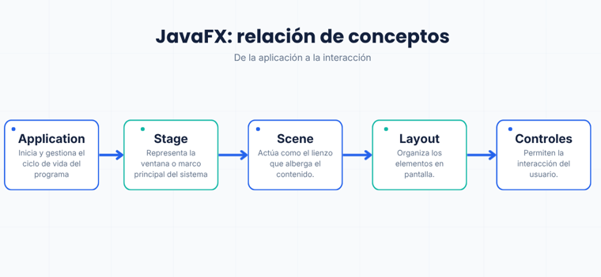

# Conociendo JavaFX desde POO

> Proyecto práctico para comprender los elementos básicos de JavaFX y su estrecha relación con la Programación Orientada a Objetos (POO), mediante la construcción de una interfaz gráfica mediante código puro.

---

## Conceptos Fundamentales

Este repositorio detalla y aplica los siguientes componentes clave en el desarrollo de interfaces:

* **JavaFX:** Framework de Java diseñado para la creación de aplicaciones de escritorio con interfaces modernas.
* **Application:** Clase abstracta fundamental que gestiona el ciclo de vida del programa (inicio, ejecución y cierre).
* **Stage:** Representa la ventana principal del sistema operativo que contiene la aplicación.
* **Scene:** El lienzo contenedor donde se estructuran y renderizan todos los elementos visuales.
* **Node:** Superclase base de la cual derivan todos los componentes que se agregan a una escena.
* **Layouts:** Contenedores (como `VBox`) encargados de organizar, alinear y dimensionar automáticamente los nodos en la pantalla.
* **Controles:** Componentes con los que el usuario interactúa (por ejemplo, `Button`, `TextField` o `Label`).
* **Eventos y `setOnAction()`:** Mecanismos que permiten definir el bloque de código que responderá a una acción específica del usuario, como un clic.

### Relación con la Programación Orientada a Objetos
JavaFX es un modelo puramente orientado a objetos. Cada elemento de la interfaz gráfica es una instancia de una clase concreta. La construcción del proyecto aprovecha pilares de la POO como la **herencia** (al extender la clase `Application`), el **encapsulamiento** (protegiendo los datos de la clase modelo) y la instanciación para separar la interfaz visual de la lógica del negocio.

---

## Mapa Conceptual de Jerarquía

La estructura visual de una aplicación en JavaFX sigue un orden estricto de contención. A continuación, se muestra cómo se relacionan los componentes:

---
## ¿Qué ventaja tiene usar una Clase Estudiante en lugar de manejar todo directamente desde los TextField? 
La principal ventaja es la separación de responsabilidades. Al extraer los datos hacia un objeto Estudiante, se separa la lógica de negocio de la interfaz gráfica. Esto hace que el código sea más escalable y mantenible; si posteriormente necesitas almacenar al estudiante en una base de datos o validar su formato, trabajas directamente con un objeto estructurado en lugar de cadenas de texto dispersas vinculadas únicamente a la interfaz.

## 2 Conceptos de POO utilizados
* **Encapsulamiento:** Ocultar los atributos nombre y matricula (usando private) y exponerlos de forma segura únicamente a través de los métodos getters.

* **Instanciación:** El uso de la palabra reservada new para generar un objeto concreto (Estudiante estudiante = new Estudiante(...)) a partir de una plantilla o clase. (También es correcto mencionar Herencia, ya que la clase principal hereda de Application).

## Dato importante
Para el desarrollo de esta actividad me ayude de Gemini IA, para entender de mejor manera cada parte del codigo y resolver dudas que me iban surgiendo.